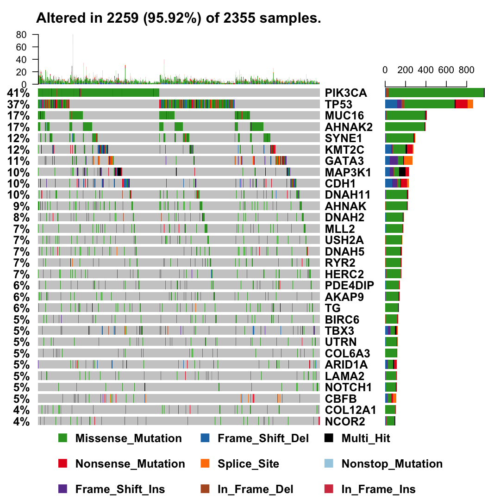
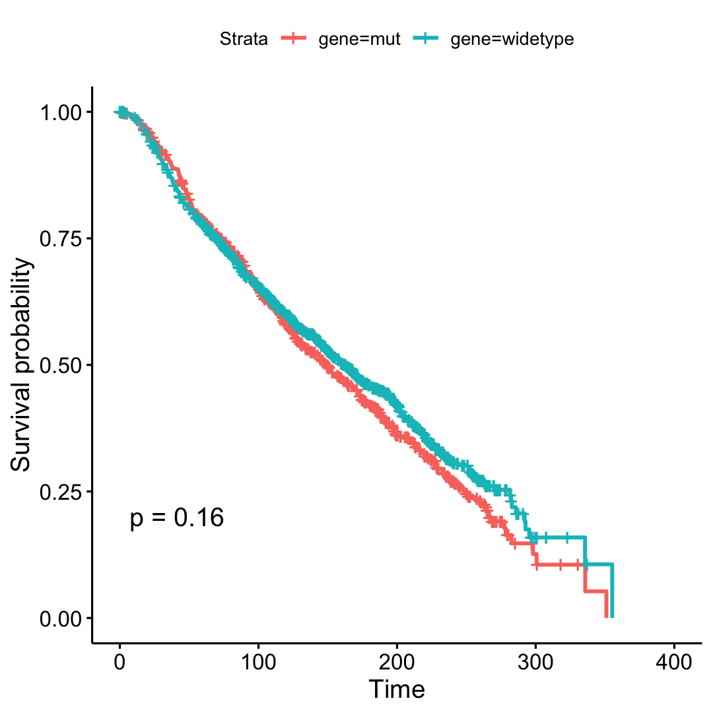
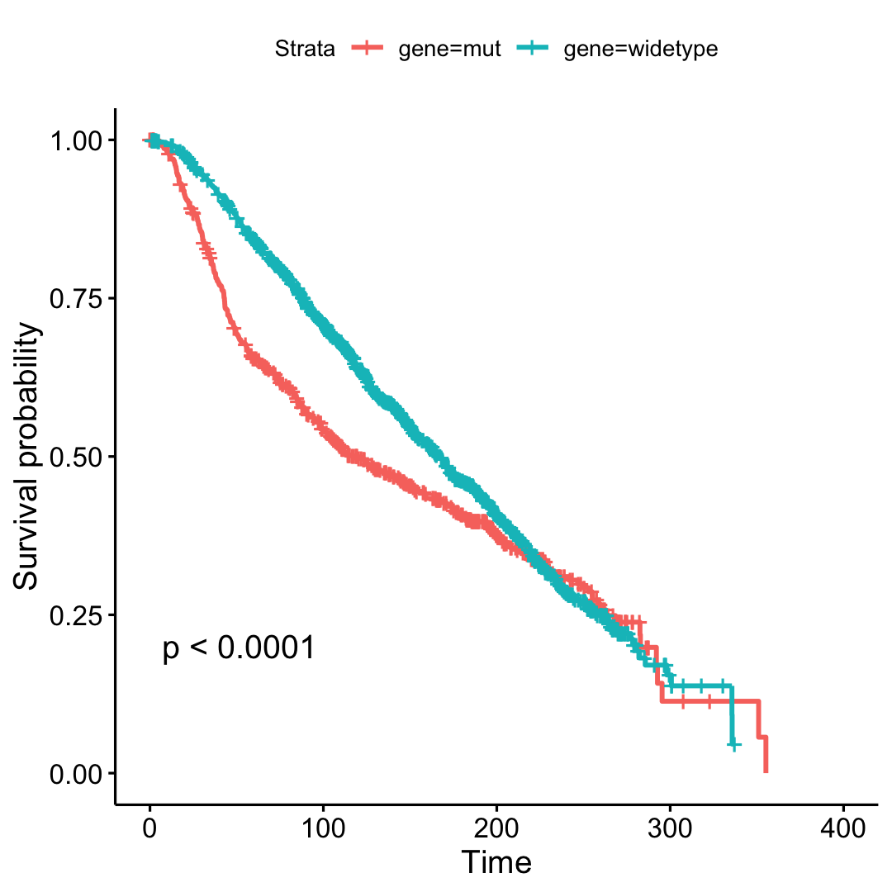
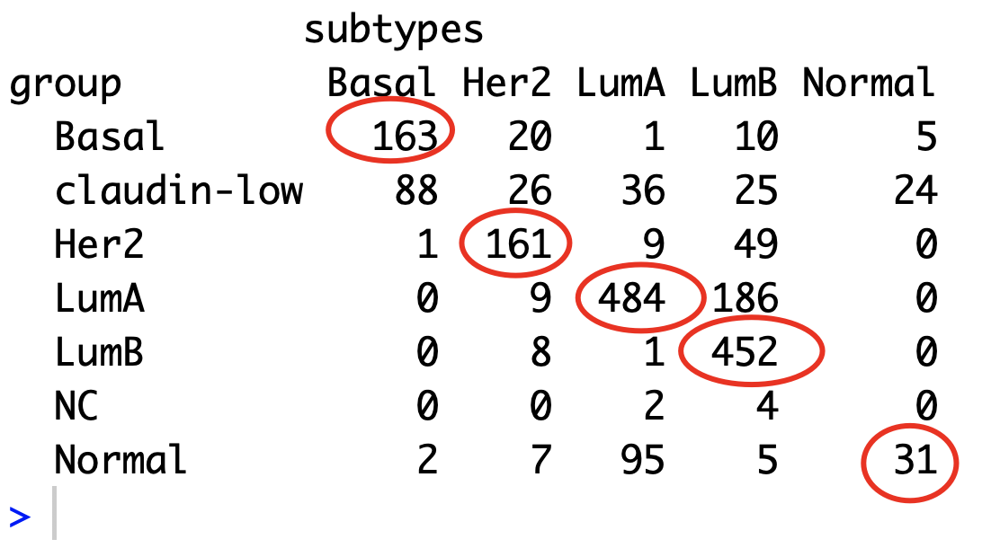
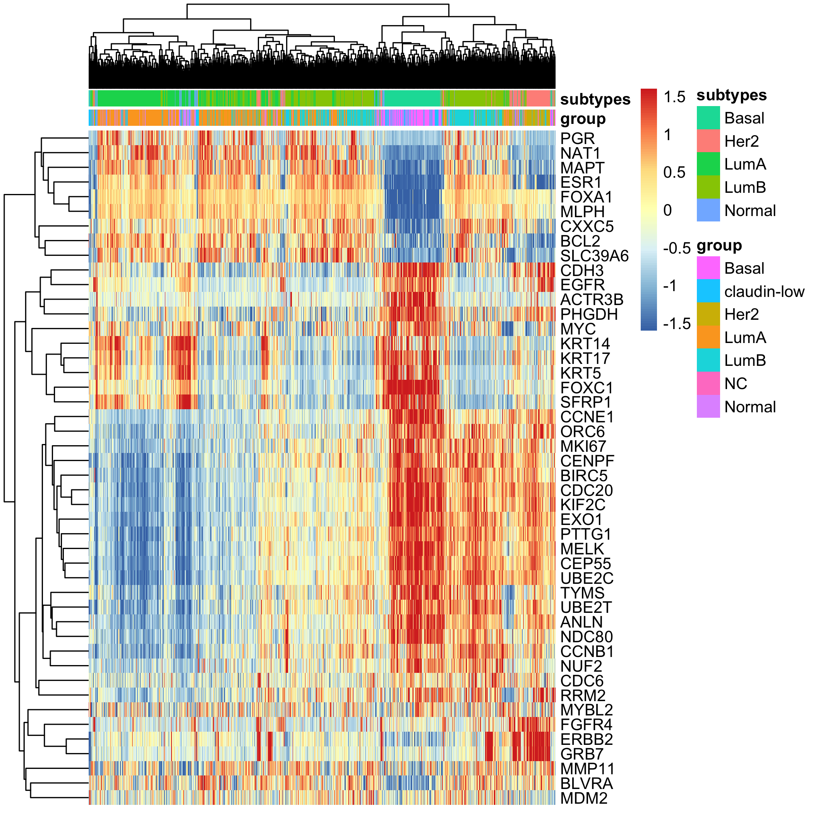

# 通过重分析METABRIC数据来理解乳腺癌的分子机制

数据来源于：http://www.cbioportal.org/data_sets.jsp 

下载属于METABRIC的数据集：[Breast Cancer (METABRIC, Nature 2012 & Nat Commun 2016)](http://www.cbioportal.org/study?id=brca_metabric#summary) 

也可以使用cbioportal的在线浏览器来了解基本项目信息：http://www.cbioportal.org/study?id=brca_metabric#summary 

### 下载的压缩包内容：

小文件如下：

```
─ [ 646]  brca_metabric
│   ├── [ 410]  LICENSE
│   ├── [ 136]  case_lists
│   │   ├── [ 20K]  cases_nat_comm_2016.txt
│   │   └── [ 16K]  cases_nature_2012.txt
│   ├── [265K]  data_clinical_patient.txt
│   ├── [102K]  data_clinical_sample.txt
│   ├── [116K]  data_gene_matrix.txt
│   ├── [1.2K]  data_gene_panel.txt
│   ├── [3.8M]  data_mutations_extended.txt
│   ├── [ 512]  meta_CNA.txt
│   ├── [ 143]  meta_clinical_patient.txt
│   ├── [ 141]  meta_clinical_sample.txt
│   ├── [ 322]  meta_expression.txt
│   ├── [ 146]  meta_gene_matrix.txt
│   ├── [ 292]  meta_mutations_extended.txt
│   ├── [ 380]  meta_study.txt
│   ├── [ 55K]  validation_error_file.txt
│   └── [ 42K]  validation_report.html
```

里面值得注意的就是那个  3.8M的文件：`  data_mutations_extended.txt`

还有一个 100M的 文件是 `data_CNA.txt` 和一个 500M的文件 `data_expression.txt`

### 记录一下GitHub小技巧

主要是是删除本地文件后提交到GitHub上面。

```
rm tmp.pdf 
git add -A 
git commit -a -m 'rm tmp'
git push -u origin master
```

当然，每次修改自己本地文件，都需要同步更新到GitHub啦。

### 检查全局突变情况

整理文章的突变信息，然后使用maftools即可出图，如下：



可以看到，突变频率比较高的基因是： `PIK3CA,TP53,MUC16,AHNAK2,SYNE1,KMT2C,GATA3,MAP3K1,CDH1` , 接下来就可以对这些基因进行针对性分析。

### 基因突变与否分组进行生存分析

取突变频率比较高的基因做生存分析，发现PIK3CA的确是突变频率非常高，但是与生存无关，如下所示：



然后就查阅文献发现有人研究了这一点：

发表于 Breast Cancer Research 2017文章是：[*PIK3CA* mutations are common in lobular carcinoma *in situ,* but are not a biomarker of progression](https://doi.org/10.1186/s13058-016-0789-y)  

当然，就会有突变能显著影响生存的，比如：



实际上，我推测啊，这些突变影响生存，应该是要根据亚型区分后再重现技术，比如TNBC本身就比其它亚型生存差，而且TNBC里面的TP53突变比例非常高，就会两个因素混在一起，到底是TP53影响生存还是亚型影响着生存。

### PAM50分类

可以看到我们使用genefu算法对METABRIC的表达矩阵进行分类，和METABRIC自己记录的病人临床信息的一致性还蛮好的



如果把PAM50分类的那50个基因挑选出来，进行表达量的热图可视化，如下：



### 更多分析

本研究仅仅是抛砖引玉，让大家熟悉这个乳腺癌领域多组学大队列，并不做细致探索，也没有科学假设，所以点到为止咯。

初期代码都在 **scripts**  文件夹， 感谢关注。

```
step0-install_packages.R
step1-check_clinical.R
step2-check-expression.R
step3-check-CNA.R
step4-check-mutations.R
step5-mutation-signatures.R
step6-maftools.R
step7-batch-survival.R
step8-pam50.R
```

